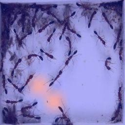
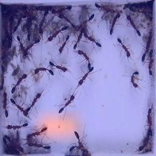
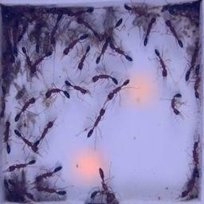
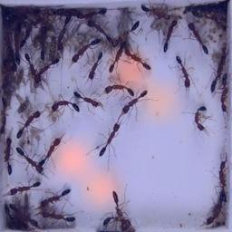
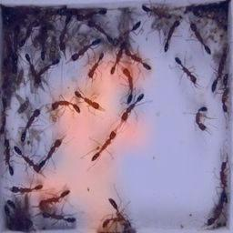
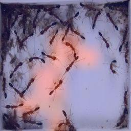

# Beyond Tracking

This repository contains the codes used for the pre-printed paper at \[[arXiv:2108.09394](https://arxiv.org/abs/2108.09394)\]: 

***"Beyond Tracking: Using Deep Learning to Discover Novel Interactions in Biological Swarms"***,
presented at the joint conference [DARS-SWARM2021](https://www.swarm-systems.com/), winning the [*Best Paper Award* at SWARM2021](https://www.swarm-systems.com/dars-swarm2021/awards#h.a6edhgurno03). 


Basically, this BeyondTracking (BT) framework has been built to *visually* highlight local behaviors in complex multi-agent systems (e.g., ant colony) that a system-level state detector considers *informative* for inference of state transitions in global system. The ultimate goal of the method is set to inform humans of *unknown* individual behaviors to better understand complex social systems.

In the paper, therefore, BT is built upon two key components, each publicly available online: 
1. [***IO-GEN***](https://github.com/ctyeong/IO-GEN)
2. [***Video data of Harpegnathos saltator ants in optical flow form***](https://github.com/ctyeong/OpticalFlows_HsAnts)
   
To be specific, IO-GEN was designed to detect abnormal states of ant colonies, while the model could only access observations of normal ant colonies. In particular, the video data of *Harpegnathos saltator* ants are used as input to IO-GEN, as each input is a sequence of *optical flow* frames from the entire view of the focal system without spatial tracking annotations. So, IO-GEN is trained to utilise the global-view observations to detect abnormal ant colonies. 

BT can then be applied to discover specific behaviors (or ant entities) that indicate the abnormal global states. Technically, [Grad-CAM](https://ieeexplore.ieee.org/document/8237336) is an essential component in BT to visualise local motions of ants from sequential frame images, but as stated in the archived paper, only highly prioritised regions are displayed in BT by thresholding to only localise highly impactful individuals. 

# Contents

1. [Expected Output](https://github.com/ctyeong/BeyondTracking#expected-output)
2. [Installation](https://github.com/ctyeong/BeyondTracking#installation)
4. [Execution](https://github.com/ctyeong/BeyondTracking#execution)
5. [Citation](https://github.com/ctyeong/BeyondTracking#citation)
6. [Contact](https://github.com/ctyeong/BeyondTracking#contact)


# Expected Output 


Validations have been performed by finding whether known key interactions, such as "dueling", are highlighted successfully. An example of dueling is shown above (with yellow dash lines), in which two engaged ants face each other to move back and forth several times. In ant communities, this aggressive interaction is already known to be an *informative* behavioral signal to predict the abnormal state in colonies of *H. saltator* ants. Hence, BT is expected to be able to discover the occurrences of dueling as key local observations whilst IO-GEN is detecting abnormal states. 


Four output examples are displayed above: (a) BT does not use thresholding for prioritisation of Grad-CAM outputs and (b)-(d) top 5\% heatmaps are observed near the ants engaged in dueling, even though spatial coordinate information was *not* provided as input.


(a)-(b) above show the resultant heatmaps appear *only* around dueling interactions (yellow lines) whilst other ants simply moving swiftly (white lines) are *ignored*. 


# Installation 

1. Clone the repository
    ```
    $ git clone https://github.com/ctyeong/BeyondTracking.git
    ```

2. Install the required Python packages

    ```
    $ pip install -r requirements.txt
    ```
   - Python 3.6 is assumed to be installed already


# Execution 

We assume:

1. A state detector has been trained with IO-GEN to be saved as a file by following [this instruction](https://github.com/ctyeong/IO-GEN#training).
    - You can find an example model at `./Model_Example_Grad_CAM/cls.h5`, which was trained to take *m=2* pairs of x,y optical flows per input. 

2. *n+1* RGB frames and *2n* pairs of x,y optical flows are in the same directory. 
    - As examples, We provide 14 folders under `./Input_Examples_Grad_CAM`, where each folder contains 10 RGB frames and 18 x- and y-axis optical flows respectively. For example, under `./Input_Examples_Grad_CAM/75`, there are such files as:

    ```
    rgb-00.jpg, rgb-01.jpg, ..., rgb-09.jpg, 
    flow_x-00-00.jpg, flow_x-00-01.jpg, flow_x-01-00.jpg, flow_x-01_01.jpg, ... flow_x-08-00.jpg, flow_x-08-01, 
    flow_y-00-00.jpg, flow_y-00-01.jpg, flow_y-01-00.jpg, flow_y-01_01.jpg, ... flow_y-08-00.jpg, flow_y-08-01  
    ```

    - Note that {`flow_x-i-00.jpg`, `flow_x-i-01.jpg`, `flow_y-i-00.jpg`, `flow_y-i-01.jpg`} in this case with *m=2* are motional representations between `rgb-i.jpg` and `rgb-(i+1).jpg`.

Then, run `main.py` with the required arguments:
```
$ python main.py -p "./Model_Example_Grad_CAM/cls.h5" -i "./Input_Examples_Grad_CAM/75" -m 2 -r 256 -f 64 -t .05 -o "./Outputs"
```

Each argument represents the following:
- `-p`: Path to the saved model from IO-GEN.
- `-i`: Directory of RGB frames and corresponding optical flows.
- `-m`: Number of optical flows per input.
- `-r`: Size of each RGB image in output.
- `-f`: Size of each optical flow image fed as input. 
- `-t`: Top % of heatmaps to visualise.
- `-o`: Output directory.  

Finally, you can find in the `./Outputs` folder *n* RGB images with the generated heatmaps as well as a `.gif` file that plays them sequentially: 
```
out-00.jpg, out-01.jpg, ..., out-08.jpg, out.gif
```

Outputs of `out-03.jpg`, `out-04.jpg`, and `out-05.jpg` from input folder `75` can be different as follows depending on `-t`: 

| `-t` | `out-03.jpg` | `out-04.jpg` | `out-05.jpg` |
|------|--------------|--------------| ------------ |
| 0.02 |  |  |  |
| 0.05 |  |  |  |
| 0.20 |  |  |  |


# Citation 

```
@article{CPLP21B,
  title={Beyond Tracking: Using Deep Learning to Discover Novel Interactions in Biological Swarms},
  author={Choi, Taeyeong and Pyenson, Benjamin and Liebig, Juergen and Pavlic, Theodore P},
  journal={arXiv preprint arXiv:2108.09394},
  year={2021}
}
```


# Contact

If there is any question or suggestion, please do not hesitate to drop an email to tchoi@lincoln.ac.uk, or DM to [@ssuty](https://twitter.com/ssuty) on Twitter! Thanks!